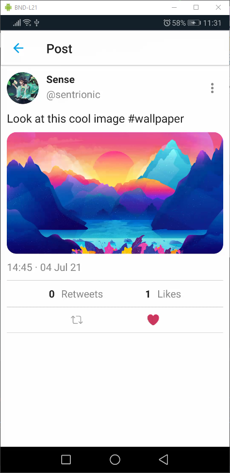

# Mirage

Mirage is a small [Twitter](https://twitter.com/) clone used to learn testing and [Jetpack Compose](https://developer.android.com/jetpack/compose).

## Screenshots

<table><tr>
  <tr>
    <td></td>
    <td></td>
    <td></td>
    <td></td>
    </tr>
    <tr>
    <td></td>
    <td></td>
    <td></td>
    <td></td>
  </tr>
  </table>

## Features

- Tweet CRUD
- Following System
- Search by username or hashtags
- Retweet-Lite
- Business Logic fully tested
- E2E Testing (backend)

## Stack Backend

- [Gin](https://gin-gonic.com/) for the REST server
- [Gorm](https://gorm.io/) as the database ORM
- PostgreSQL
- Redis
- S3 for storing files
- Github Actions to test on every commit

## Stack Mobile

- [Jetpack Compose](https://developer.android.com/jetpack/compose) to create the views
- [Retrofit](https://square.github.io/retrofit/) for HTTP Requests
- [Android Room](https://developer.android.com/training/data-storage/room) as the cache
- [Hilt](https://developer.android.com/training/dependency-injection/hilt-android) for depencency injection

The app structure is based on [codingwithmitch's compose course](https://github.com/mitchtabian/food2fork-compose).

---

## Installation

### Server

(If you are familiar with `make`, take a look at the `Makefile` to quickly setup the following steps)

1. Install Docker and get the Postgresql and Redis containers
2. Create a DB
3. Install Golang and get all the dependencies
4. Rename `.env.example` to `.env` and fill in the values

- `Required`

        PORT=8080
        DATABASE_URL="postgresql://<username>:<password>@localhost:5432/db_name"
        REDIS_URL=redis://localhost:6379
        CORS_ORIGIN=http://localhost:3000
        SECRET=SUPERSECRET
        HANDLER_TIMEOUT=5
        MAX_BODY_BYTES=4194304 # 4MB in Bytes = 4 * 1024 * 1024
        COOKIE_NAME=mqk
        DOMAIN=DOMAIN

- `Optional: Not needed to run the app, but you won't be able to upload files.`

        AWS_ACCESS_KEY=ACCESS_KEY
        AWS_SECRET_ACCESS_KEY=SECRET_ACCESS_KEY
        AWS_STORAGE_BUCKET_NAME=STORAGE_BUCKET_NAME
        AWS_S3_REGION=S3_REGION

5. Run `go run github.com/sentrionic/mirage` to run the server

### App

1. Clone the repository and open the `app` directory in Android Studio.
2. Set the `BASE_URL` in `Constants.kt`. If the backend runs locally, make sure to also add `android:usesCleartextTraffic="true"` to the Android Manifest.
3. Run the app.

---

## Testing

### Server

1. To test the business logic in the handler and service directories run `go test -v -cover ./service/... ./handler/...` (or `make test`).

2. To test the routes, run `go test -run '^\QTestMain_E2E\E$\'` (or `make e2e`)

### App

To run the use case tests simply right click the `app` directory in the `test` directory and select `Run tests in 'xyz.mirage...'`

---

## Known Issues

### App

- Backstack keeps growing.
  - Haven't found a good solution to that problem yet.
- Screen transition animations flicker white when using dark mode.
